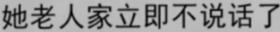
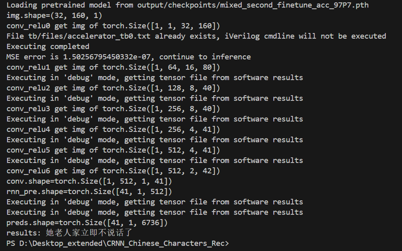

# Characters Recognition Hardware Accelerator

This is a Chinese characters recognition repository based on convolutional recurrent networks. With hardware accelerators designed for *Conv2d* and *LSTM* layers, this code include syntheticable verilog modules and testbenches, respectively.

## Performance


This CRNN Inference unit achieves an accuracy of up to **97.7%**.

## Environments
1. Windows 10/11 64-bit
2. Python 3.12.2 64-bit
3. **PyTorch 2.2.2** with cuda 12.1 🔥
4. yaml
5. easydict
6. Icarus Verilog + vvp + GTKWave for Hardware debugging

## Data
1. Download the [dataset](https://pan.baidu.com/s/1ufYbnZAZ1q0AlK7yZ08cvQ)
2. Edit **lib/config/360CC_config.yaml** DATA:ROOT to you image path
3. Download the [labels](https://pan.baidu.com/s/1oOKFDt7t0Wg6ew2uZUN9xg) (password: eaqb)
4. Put *char_std_5990.txt* in **lib/dataset/txt/**
5. And put *train.txt* and *test.txt* in **lib/dataset/txt/**
6. All pretrained model, reshaped image data for example, parameters in (https://disk.pku.edu.cn/link/AABB34C524BE09437CA4C1E9765DC7A662)
7. Your own data (images with Chinese Characters for OCR) in **images/**

## Demo
*How to use?*
```
[run] python demo.py --image_path path_of_your_image.png --checkpoint output/checkpoints/mixed_second_finetune_acc_97P7.pth --i_bits 10 --f_bits 13
```
*Options for execution*

[image_path]path of your imageparser.add_argument<br />
[i_bits]bits of integer part in fixed point number<br />
[f_bits]bits of fraction part in fixed point number<br />
[cfg]experiment configuration filename<br />
[checkpoint]the path to your checkpoints

By default, demo will run in high efficiency demo mode, it will not execute the hardware accelerator code but read our predumped files. If you want to run the code in full mode, please delete the corresponding output file in /tb/files and set the corresponding debug parameter in demo.py to 0.
